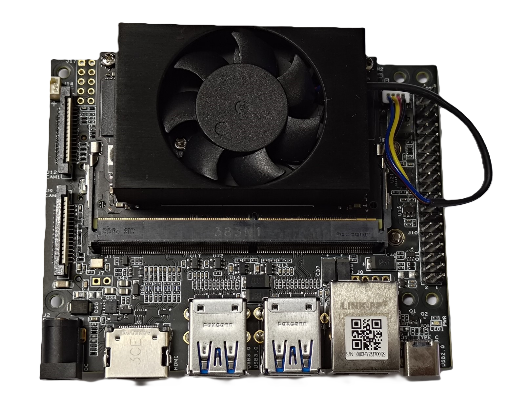
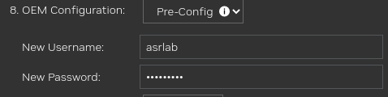

# Setting Up NVIDIA Jetson Orin Nano

This tutorial was written for setting up the NVIDIA Jetson Orin Nano 8 GB. The specification and performance benchmarks with Jetson Orin Nano is posted in this [link](https://developer.nvidia.com/blog/solving-entry-level-edge-ai-challenges-with-nvidia-jetson-orin-nano/).

## 0. Prerequisite

The **NVIDIA Software Development Kit (SDK) Manager** provides an end-to-end development environment setup solution for Jetson Orin Nano platform. To flash the system on the Jetson device, the **NVIDIA SDK Manager** need to be installed on a **Linux Host Machine**.

**IMPORTANT NOTE:** The **Host machine** must be running on **Ubuntu 20.04** to flash the device.

The requirement of the **Host machine** is listed as belows:

| Host Machine Specificaton | |
| --- | --- |
| Distribution | Ubuntu Desktop 20.04 |
| Internet | Working internet connect |
| Memory | At least 8GB |
| Free disk space | A minimum of 32GB  free disk space on the system volume is needed for each full host deployed SDK version |

The **NVIDIA SDK Manager** can be downloaded from [https://developer.nvidia.com/nvidia-sdk-manager](https://developer.nvidia.com/nvidia-sdk-manager).


After downloading the file, install the **NVIDIA SDK Manager** by the following command:

```sh
sudo apt install sdkmanager_[version]-[build_number]_amd64.deb
```

where `[version]` and `[build_number]` cand be found on the downloaded filename.

The **NVIDIA SDK Manager** can be started using one of the following two methods:

1. Launch the SDK Manager from the Ubuntu launcher.
2. Open terminal and launch with the following command:

```sh
sdkmanager
```

On the **Jetson Orin Nano** device, an **NVME SSD** with at least 128GB of storage should be mounted as the storage compoment. The details of the device is following as:

| Target Hardware Details | |
| --- | --- |
| Distribution | Ubuntu Desktop 22.04 |
| L4T | 36.3.0 |
| Jetpack | 6.0 (rev. 2) |


Jetson Orin Nano device (top-side).

Jetson Orin Nano device with mounted NVME SSD (bottom-side).

## 1. Flashing Jetson Orin Nano on NVME

### **Step 1**: Launch the **NVIDIA SDK Manager**.


### **Step 2**: Select the `Target Hardware` as **Jetson Orin Nano modules** and `SDK version` as **Jetpack 6.0 (rev. 2)** (latest).


If you want install other device and version, click the `...` to change.

Click `Continue TO STEP 02` to move on the next step.

### **Step 3**: Download the host and target components.


For the slow internet connection, it should be download all components before the installation. 

When the download completed, click `BACK TO STEP 01`.


Then click `CONTINUE TO STEP 02` and only select `I accept the terms and conditions of the license agrrements`.


Click `CONTINUE TO STEP 03` for the further process.

### **Step 4**: Flash the sytem to the `Target Hardware`.

Before flashing, it will show the window as belows. 


Change to `Manual Setup - Jetson Orin Nano 8GB`. Then follow step-by-step carefully in the manual setup mode.


#### **Step 4.1**: Hardware verification
Ensure the `Jetson Orin Nano` is powered off and the power adapter disconnected.

Verify the NVME SSD is mounted to the **Jetson Orin Nano**.

#### **Step 4.2**: Pre-configuration 

Move to `8. OEM Configuration`, set up new username and password.



Move to `9. Storage Device`, change to `NVME`.


#### **Step 4.3**: Set up the **Force Recovery Mode** for the hardware

Place a jumper across the **Force Recovery Mode** pins. Stick to the `FC REC` (10) and `GND` (9) pins.


#### **Step 4.4**: Connect the host and target devices

Connect the host computer to the target device's USB Type-C connector.

Connect Ethernet RJ45 cable between the host computer and the target device.


#### **Step 4.5**: Power hardware into **Force Recovery Mode**

Connect the power connect to the power jack. The device will automatically power on in **Force Recovery Mode**.

Then remove the jumper from the **Force Recovery Mode** pins. On the monitor, select the correct board for flashing.


In this case, the **Jetson Orin Nano 8GB** is selected.

#### **Step 4.6**: Flash the target machine

Confirm the settings and start to flash the target device.


#### **Step 4.7**: Install target device's SDK components

After flashing, you can direct log in to the Jetson device. Connect the device to a monitor via HDMI port.

Check the IPv4 address in the **Jetson Orin Nano** device.


Back to **SDK Manager** on host machine, change to `Ethernet` connect to guanrantee the connection.


When finishing the installation, exit the **NVIDIA SDK Manager** and start setting up on the **Jetson Orin Nano**.

## 2. Setting up the Jetson Orin Nano

First, update the system

```sh
sudo apt update -y && sudo apt upgrade -y
sudo apt autoremove
sudo reboot
```

Then, install dependencies:

```sh
sudo apt install -y ssh firefox zlib1g software-properties-common cmake build-essential curl wget htop unzip nano
```

Install Python3 and dependecies:

```sh
sudo apt install -y python3 python3-dev python3-distutils python3-pip python3-venv
```

Install Miniforge3:

```sh
curl -L -O "https://github.com/conda-forge/miniforge/releases/latest/download/Miniforge3-$(uname)-$(uname -m).sh"
bash Miniforge3-$(uname)-$(uname -m).sh
```

## 3. Verifying CUDA Toolkit and cuDNN

Verify `nvcc` by following command:

```sh
nvcc --version
```

If `nvcc` does not found, update the `nvidia-jetpack`.

```sh
sudo apt install -y nvidia-jetpack
```

The `nvidia-jetpack` can be verified by following command:

```sh
sudo apt show nvidia-jetpack
```

Update the paths in `~/.bashrc`

```sh
export PATH=/usr/local/cuda/bin${PATH:+:${PATH}}
export LD_LIBRARY_PATH=/usr/local/cuda/lib64${LD_LIBRARY_PATH:+:${LD_LIBRARY_PATH}}
```

Run command `source ~/.bashrc` to activate modification and then rerun command:

```sh
nvcc --version
```

The cuDNN source files need to be copied to the `/usr/local/cuda` directory.

```sh
cd /usr/include && sudo cp cudnn* /usr/local/cuda/include
cd /usr/lib/aarch64-linux-gnu && sudo cp libcudnn* /usr/local/cuda/lib64
```

Provide the permission for the copied files.

```sh
sudo chmod 777 /usr/local/cuda/include/cudnn.h
sudo chmod 777 /usr/local/cuda/lib64/libcudnn*
```

Set the symbolic links for cuDNN.

```sh
cd /usr/local/cuda/lib64
sudo ln -sf libcudnn.so.8.6.0 libcudnn.so.8
sudo ln -sf libcudnn_ops_train.so.8.6.0 libcudnn_ops_train.so.8
sudo ln -sf libcudnn_ops_infer.so.8.6.0 libcudnn_ops_inter.so.8
sudo ln -sf libcudnn_adv_train.so.8.6.0 libcudnn_adv_train.so.8
sudo ln -sf libcudnn_adv_infer.so.8.6.0 libcudnn_adv_inter.so.8
sudo ln -sf libcudnn_cnn_train.so.8.6.0 libcudnn_cnn_train.so.8
sudo ln -sf libcudnn_cnn_infer.so.8.6.0 libcudnn_cnn_inter.so.8
sudo ldconfig
```

To verify the CUDA Toolkit, download the `cuda-samples`:

```sh
git clone https://github.com/NVIDIA/cuda-samples.git
```

Run the `deviceQuery` example

```sh
cd cuda-samples/Samples/1_Utilities/deviceQuery
make clean && make
./deviceQuery
```

For cudnn performance, install neccessary packages for cudnn sample

```sh
sudo apt-get install -y g++ freeglut3-dev build-essential libx11-dev libxmu-dev libxi-dev libglu1-mesa-dev libfreeimage-dev libglfw3-dev
```

Copy the `cudnn_samples_v8` to  `$HOME`:

```sh
sudo cp -r /usr/src/cudnn_samples_v8 $HOME
sudo chmod 777 $HOME/cudnn_samples_v8
cd $HOME/cudnn_samples_v8/mnistCUDNN
./mnistCUDNN
```

When these samples passed, it confirms that the CUDA and cuDNN can work in the device.